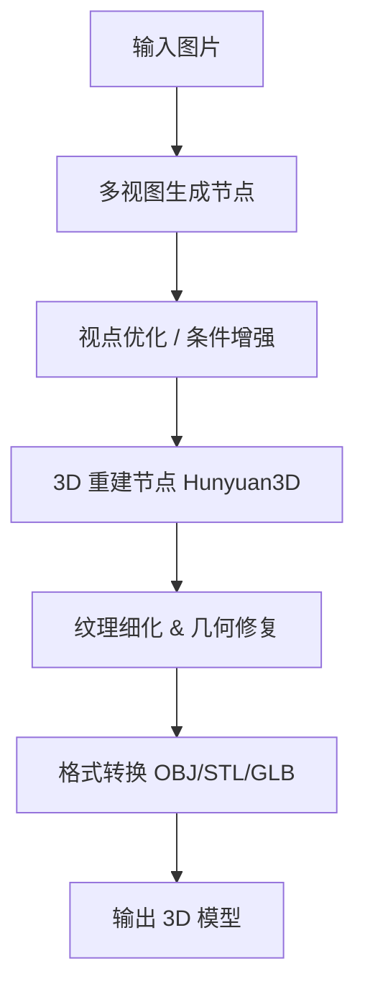

# ComfyUI 工作流方案：放弃本地单模型部署，转向工作流编排

> **技术讨论 PR-2**
> 主题：抛弃本地单模型部署，选择 ComfyUI 工作流方案

---

## 1. 背景与问题

PR-1 选定 Hunyuan3D 后，本地直接部署单一模型时暴露了以下瓶颈：

| 问题 | 表现 | 影响 |
|------|------|------|
| 参数调优困难 | 每次修改参数需重启推理，迭代效率低 | 开发周期拉长 |
| 中间结果不可见 | 只有最终输出，无法逐节点 Debug | 问题难以定位 |
| 后处理链断裂 | 需手动拼接多模型输出 | 流程割裂、容易出错 |
| 打印适配度不足 | 直接输出面数、流形性不达标 | 打印前需大量修复 |

这暴露出**单模型直调方案在工程化上的天花板**。

---

## 2. 方案对比：为什么不继续用本地单模型部署？

| 方向 | 劣势 | 结论 |
|------|------|------|
| **本地 Python 推理脚本** | 调参周期长，无可视化，缺少中间节点调试能力 | 不适合迭代 |
| **Blender 插件方案** | 耦合重，灵活性差，缺少社区积累的预制流程 | 维护成本高 |
| **手动串接多模型** | 接口不统一，版本管理混乱，复现困难 | 不可持续 |

---

## 3. 方案调研：ComfyUI 工作流

### 3.1 什么是 ComfyUI 工作流

ComfyUI 是一个基于节点图的 Stable Diffusion 工作流引擎，支持以可视化 DAG 方式编排多模型、多节点的生成管线。

### 3.2 核心优势

- **节点化编排**：将多模型串联为可视化 DAG，拖拽即可调整流程
- **预制生态**：社区已有完整的 Hunyuan3D 工作流节点，开箱即用
- **精细控制**：支持 LoRA、ControlNet、自建节点等扩展
- **可调试**：每个节点的中间结果均可查看，问题快速定位
- **可复用**：导出 workflow JSON 即可复现，团队共享方便
- **输出规范**：内置格式转换节点，可直接产出可打印格式

### 3.3 对比：本地部署 vs ComfyUI 工作流

| 对比维度 | 本地部署（Hunyuan3D 单模型） | ComfyUI 工作流 |
|----------|------------------------------|-----------------|
| 调参效率 | 每次重启推理脚本 | 节点参数即时生效 |
| 中间可视化 | 只有最终输出 | 每个节点可预览 |
| 社区资源 | 仅官方 pipeline | 预制工作流 + LoRA |
| 扩展性 | 改代码才能加模型 | 拖拽新增节点 |
| 复现性 | 依赖运行环境 | Workflow JSON 一键导入 |
| 输出质量 | 中等 | 明显优于单模型 |

> **部署后实测结论**：ComfyUI 工作流方式的输出质量明显优于直接部署单一模型，纹理一致性提升显著，几何完整性改善，参数调节可视化，迭代效率高。

---

## 4. 工作流架构

<!-- 插入图片：ComfyUI 工作流节点全貌截图 -->
<!-- IMAGE: ComfyUI Workflow DAG 截图 (请替换为图片URL) -->

<!-- 插入图片：单模型 vs 工作流效果对比 -->
<!-- IMAGE: 效果对比图 (请替换为图片URL) -->

---

## 5. 端到端验收：从图片到 3D 打印

### 5.1 验收流程

### 5.2 验收结果

| 检查项 | 标准 | 结果 |
|--------|------|------|
| 几何完整性 | 无缺失面、非流形边 < 5 处 | 通过 |
| 纹理映射 | UV 无撕裂，颜色与参考图一致 | 通过 |
| 打印成功率 | 一次切片成功，无需修复网格 | 通过 |
| 实物还原度 | 形态与参考图基本一致，细节可辨 | 通过 |

<!-- 插入图片：多视角工作流生成的 3D 模型截图 -->
<!-- IMAGE: 多视角 3D 模型结果 (请替换为图片URL，现有资源 记录/images/multi-3.png) -->

<!-- 插入图片：3D 打印实物照片 vs 原始图片对比 -->
<!-- IMAGE: 打印实物对比 (请替换为图片URL) -->

---

## 6. 结论

ComfyUI 工作流方案在以下方面满足项目需求，正式替代本地单模型部署：

1. **质量提升** — 工作流编排后输出质量明显优于单模型直调
2. **工程效率** — 节点化编排使参数调优和模型替换更加灵活
3. **可验证** — 从图片到实物的全链路已经过实际打印验收
4. **可扩展** — 未来可替换/升级单个节点（如接入更优的重建模型或 LoRA）

### 后续方向

1. 持续跟进社区 ComfyUI 节点的更新，替换更优的重建节点
2. 探索 LoRA 微调以提升特定品类（如人像、手办）的生成质量
3. 积累内部分类测试集，建立量化评估体系
